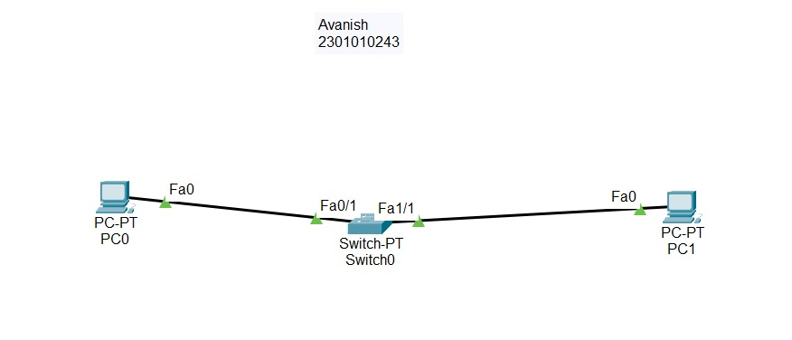
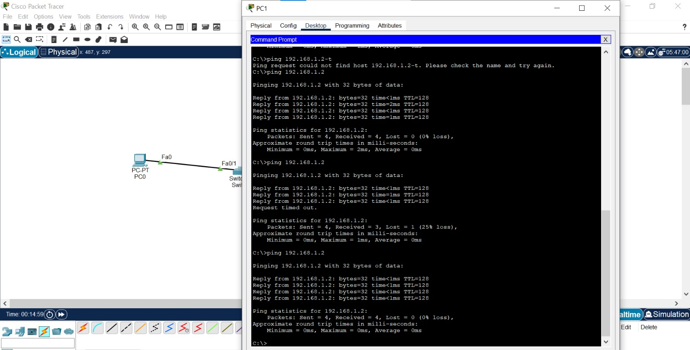

# Experiment 11: Web Server Simulation: HTTP and WWW Basics

**Institution:** K.R. Mangalam University

---

## Objective
Create a simulation to demonstrate the workings of HTTP (Hypertext Transfer Protocol) and the World Wide Web by implementing basic HTTP request and response handling within Cisco Packet Tracer.

## Theory
HTTP is an application-layer protocol used for transmitting hypermedia documents, such as HTML. It functions as a request-response protocol in the client-server computing model, serving as the foundation of data communication for the World Wide Web. When a user enters a URL, the client (browser) sends a request to the server, which then processes the request and returns the requested resources.

---

## Network Topology
  
*(Above: A typical client-server network topology featuring a dedicated Web Server and client PCs).*

---

## Step-by-step Procedure

1. **Topology Setup:** Built a network topology consisting of one Web Server and multiple client PCs connected via a switch.
2. **IP Addressing:** Assigned static IP addresses to the PCs and the Server.
3. **Enable Service:** Clicked on the Server, navigated to the Services tab, and ensured the HTTP service was turned ON.
4. **Content Customization:** Edited the `index.html` file on the server's file manager to include a custom message: "Welcome to Cisco Packet Tracer Web Server!"
5. **Client Access:** On PC0, opened the Web Browser and entered the Server's IP address (e.g., `http://192.168.1.1`) to request the page.
6. **Traffic Observation:** Switched to Simulation Mode to monitor the traffic, specifically observing the HTTP GET request sent by the client and the HTTP response returned by the server.

---

## Configuration Commands
**N/A** (Configurations handled via the Server's HTTP Service GUI and PC Desktop applications).

---

## Observations / Results
  
* The custom HTML page successfully rendered within the client's web browser application after the IP address was entered.
* Simulation mode captured the full application-layer interaction: PC0 initiated an **HTTP GET** request, and the Web Server successfully parsed the request and delivered the corresponding HTML payload in its **200 OK** response.

---

## Conclusion
Successfully demonstrated the core mechanics of the World Wide Web. The simulation illustrated how web clients and servers interact over HTTP to request, transfer, and render web content seamlessly, highlighting the reliability of the request-response cycle in modern networking.
