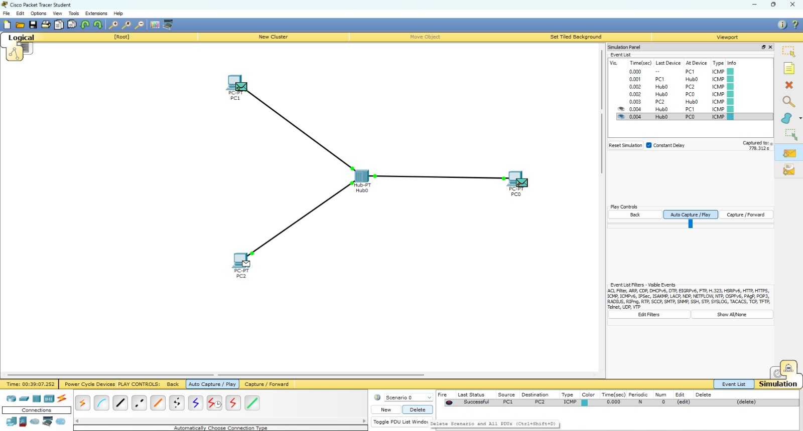

# Design and Simulation of Basic Network Topologies using Cisco Packet Tracer

## 1. Introduction
This project focuses on understanding basic computer networking concepts by designing and simulating different network topologies using Cisco Packet Tracer. The goal is to observe how devices communicate, how data flows in a network, and how different networking devices behave.

---

## 2. Objectives
- To design basic wired and wireless network topologies  
- To understand the working of hub, switch, and access point  
- To configure IP addresses manually  
- To test communication using ICMP (ping)  
- To analyze packet flow using simulation mode  

---

## 3. Tools and Technologies
- Cisco Packet Tracer  
- Devices used:
  - PC  
  - Laptop  
  - Hub  
  - Switch  
  - Access Point  

---

## 4. Project Overview
The project consists of three main network setups:

1. Hub-based wired network  
2. Switch-based wired network  
3. Wireless network using access point  

Each network is tested using ICMP to verify communication between devices.

---

## 5. Implementation Details

### 5.1 Hub-Based Network

#### Steps:
1. Open Cisco Packet Tracer  
2. Add 3 PCs and 1 Hub  
3. Connect all PCs to the hub using copper straight-through cables  
4. Assign IP addresses:
   - PC0: 192.168.1.1  
   - PC1: 192.168.1.2  
   - PC2: 192.168.1.3  
5. Switch to Simulation Mode  
6. Send ICMP packet using Add Simple PDU  

### Observation:
The hub broadcasts data to all connected devices, making communication inefficient.

#### Image:

