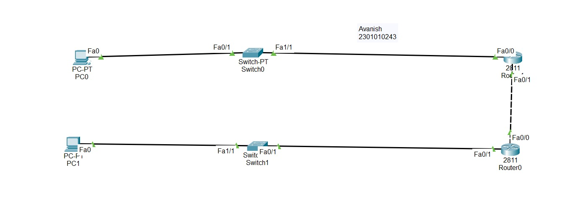

# Experiment 5: Flow Control and Error Control Protocols
**Institution:** K.R. Mangalam University 

## Objective
Design and simulate flow control and error control protocols such as Stop and Wait, Go-Back-N ARQ, and Selective Repeat ARQ using Cisco Packet Tracer to compare their performance under varying network conditions.

## Theory
* **Stop and Wait:** The sender transmits one frame and waits for an acknowledgment before sending the next. 
* **Go-Back-N ARQ:** The sender can transmit multiple frames before needing an acknowledgment, but if an error is detected, it retransmits all frames from the erroneous frame onward.
* **Selective Repeat ARQ:** The sender transmits multiple frames, but only retransmits the specific individual frame that encountered an error.

## Network Topology

*(Above: A complex network topology utilizing two PCs, two Switches, and two 2811 Routers connected via a crossover cable to simulate network delay and routing for flow control).*

## Step-by-step Procedure
1. Created a network topology using two PCs (PC0, PC1), two Switches (Switch0, Switch1), and two 2811 Routers.
2. Connected the devices: 
   * Copper Straight-Through cables from PCs to Switches (`Fa0` to `Fa0/1` and `Fa1/1`).
   * Copper Straight-Through cables from Switches to Routers (`Fa1/1` to `Fa0/0`).
   * Copper Cross-Over cable to connect the two Routers directly to each other (`Fa0/1` to `Fa0/1`).
3. Assigned IP addresses to PC0 and PC1.
4. Configured the router interfaces with IP addresses and enabled the ports (`no shutdown`). Configured static routing to ensure end-to-end connectivity between the two distant subnets.
5. Used the "Add Simple PDU" tool to generate ICMP traffic from PC1 to PC0.
6. Switched to **Simulation Mode** to observe the packet transmission process step-by-step, analyzing how the network handles the simulated window of frames.

## Configuration Commands
*(Example configuration for establishing the router link)*
```text
Router> enable
Router# configure terminal
Router(config)# interface fastEthernet 0/1
Router(config-if)# ip address 10.0.0.1 255.255.255.0
Router(config-if)# no shutdown
Router(config-if)# exit
