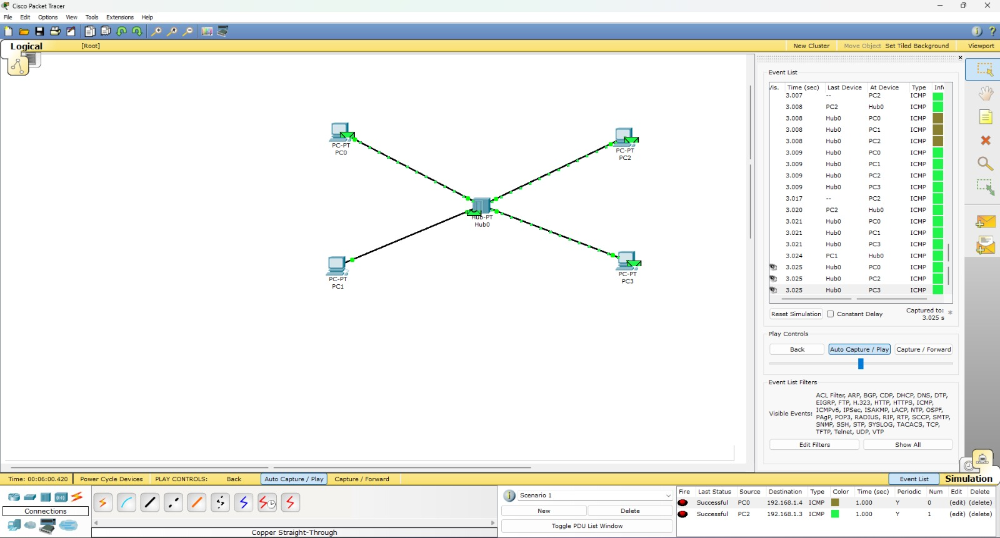

# Experiment 6: Simulation of Multiple Access Protocols

**Institution:** K.R. Mangalam University  

---

## Objective
Develop a simulation to demonstrate multiple access protocols (Pure ALOHA, Slotted ALOHA, CSMA/CD, and CSMA/CA) and analyze their performance in handling network collisions and maximizing efficiency.

## Theory

* **ALOHA:** Nodes transmit whenever they have data, leading to high collision rates. Slotted ALOHA improves this by forcing transmissions to begin at specific time slots.
* **CSMA/CD (Carrier Sense Multiple Access with Collision Detection):** Used in wired networks. Devices listen to the medium; if a collision is detected, they stop, wait a random backoff time, and retransmit.
* **CSMA/CA (Collision Avoidance):** Used in wireless networks to broadcast intent before sending, avoiding collisions.

---

## Network Topology

*(Above: A shared medium network topology utilizing a Hub to force a single collision domain).*

.jpeg)
*(Above: A shared medium network topology utilizing a Hub to force a single collision avoid).*
---

## Step-by-step Procedure

1. **Topology Setup:** Created a network topology with multiple sender and receiver nodes connected via a Hub to create a shared collision domain.
2. **IP Configuration:** Configured static IP addresses for all connected PCs.
3. **Traffic Generation:** Used the **Add Simple PDU** tool to generate simultaneous ICMP traffic from multiple PCs to force a network collision.
4. **Simulation Execution:** Switched to **Simulation Mode** to observe the collision event and the subsequent retransmission attempts.
5. **Data Collection:** Documented the frequency of collisions and how the devices applied backoff algorithms to retransmit.

---

## Configuration Commands
**N/A** (This experiment relies on visual simulation and PDU behavior rather than CLI configuration).

---

## Observations / Results

* A collision was visually indicated (fire icon) when multiple nodes attempted to transmit across the hub simultaneously.
* The simulation demonstrated that CSMA/CD effectively handles these collisions by dropping the corrupted frames and utilizing a random backoff timer before re-attempting transmission.

---

## Conclusion
The simulation successfully demonstrated the limitations of shared mediums and the necessity of multiple access protocols. CSMA/CD proved essential for maintaining data transmission efficiency and resolving collisions in wired environments.
