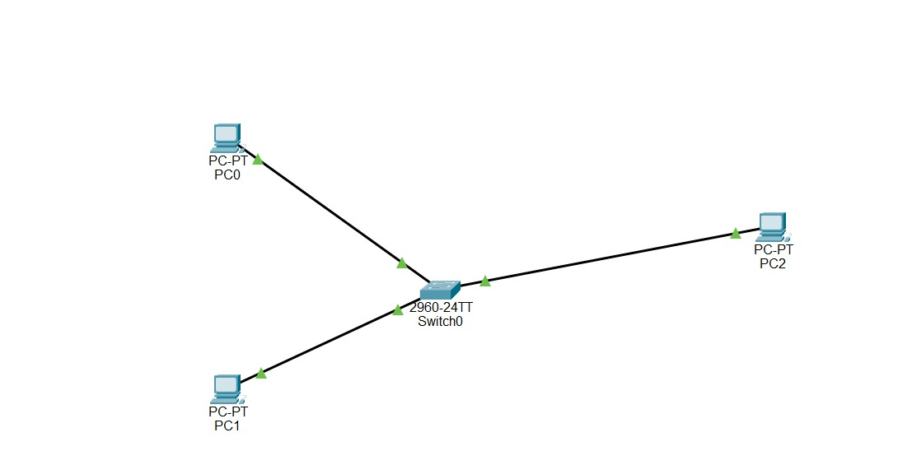

# Experiment 7: Implementation of Sliding Window Protocol with Piggybacking

**Institution:** K.R. Mangalam University

---

## Objective
Implement a sliding window protocol with piggybacking for efficient data transmission and error control, simulating data transfer between two nodes to visualize window movements and acknowledgments.

## Theory

* **Sliding Window:** A flow control protocol that allows a sender to transmit multiple frames (up to a specific window size) before requiring an acknowledgment, vastly improving throughput.
* **Piggybacking:** An efficiency technique where the acknowledgment for a received frame is temporarily delayed and attached (piggybacked) onto the next outgoing data frame heading back to the sender.

---

## Network Topology

*(Above: A direct network topology featuring a sender and receiver node).*

---

## Step-by-step Procedure

1. **Topology Setup:** Created a network topology with two nodes (PC0 as sender, PC1 as receiver) connected directly or via a simple switch.
2. **IP Addressing:** Assigned IP Addresses to both PCs.
3. **Documentation:** Added workspace notes explaining the theoretical application of Sliding Window and Piggybacking in this data transfer.
4. **Traffic Initiation:** Opened the Command Prompt on PC0 and initiated a continuous data stream (e.g., continuous ping) to PC1 to simulate the transmission of multiple frames.
5. **Simulation Mode:** Switched to Simulation Mode and used the Capture/Forward button to step through the packet exchanges.
6. **Frame Analysis:** Clicked on the packets in the Event List to view detailed sequence numbers and acknowledgment data.

---

## Configuration Commands
* **PC0 Command Prompt:** `ping -t <IP_of_PC1>`

---

## Observations / Results

* Observed continuous data frames being sent consecutively, simulating the sliding window filling up.
* Outgoing data frames from PC1 included acknowledgments for the frames received from PC0, successfully demonstrating the piggybacking concept.

---

## Conclusion
The simulation successfully visualized the sliding window mechanism and piggybacking. Analyzing the sequence numbers confirmed that these techniques significantly reduce network overhead and improve transmission efficiency compared to simple Stop-and-Wait protocols.
