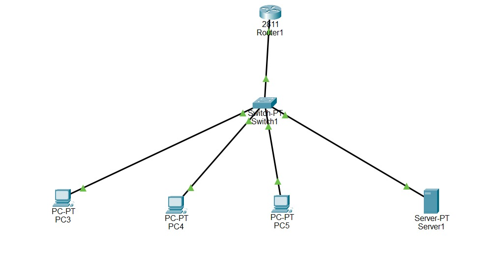

# Experiment 8: Simulation of Logical Addressing using IPv4 and IPv6

**Institution:** K.R. Mangalam University

---

## Objective
Create a simulation to demonstrate logical addressing using IPv4 and IPv6, and implement address mapping techniques such as ARP, RARP, BOOTP, and DHCP to show how devices acquire and resolve addresses.

## Theory

* **DHCP (Dynamic Host Configuration Protocol):** Automatically assigns IP addresses and network configuration (such as subnet masks and default gateways) to client devices.
* **ARP (Address Resolution Protocol):** Resolves a known logical IP address to an unknown physical MAC address to facilitate local network communication.
* **IPv6:** The next-generation protocol providing a massively expanded 128-bit address space, designed to replace IPv4.

---

## Network Topology
  
*(Above: A network topology including a DHCP Server, a Router, a Switch, and client PCs).*

---

## Step-by-step Procedure

1. **Topology Design:** Designed a network topology including PCs, a Router, a Switch, and a Server.
2. **Static Configuration:** Assigned static IPv4 and IPv6 addresses to the Server and Router interfaces.
3. **DHCP Setup:** Accessed the Server's Services tab, enabled DHCP, and configured a pool with a range of IP addresses, subnet mask, and default gateway.
4. **Client Configuration:** Configured the PCs to acquire their IP addresses via DHCP instead of static entry.
5. **ARP Simulation:** Opened the Command Prompt on PC0 and pinged PC1 to initiate an ARP request. Switched to Simulation Mode to observe the ARP broadcast and the resulting MAC address resolution.
6. **Verification:** Verified communication using both IPv4 and IPv6 `ping` commands to ensure end-to-end connectivity.

---

## Configuration Commands
**N/A** (Configurations handled via GUI menus for PC interfaces and Server services).

---

## Observations / Results
  
* The client PCs successfully acquired dynamic IPv4 configurations from the DHCP server via the DORA (Discover, Offer, Request, Acknowledge) process.
* The simulation visually captured the ARP Request broadcasting to all switch ports, followed by the unicast ARP Reply returning the target MAC address.

---

## Conclusion
Successfully demonstrated IPv4 and IPv6 logical addressing. The implementation of DHCP streamlined address allocation, while the simulation mode provided clear visualization of the ARP mapping techniques required for packet delivery.
