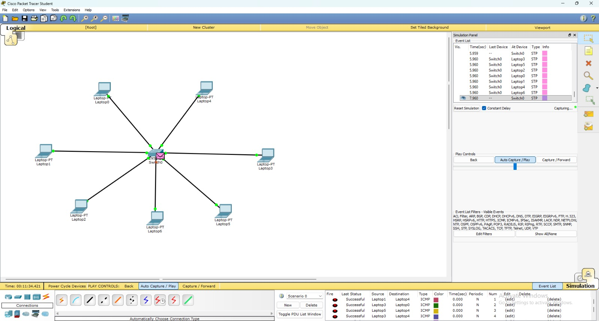
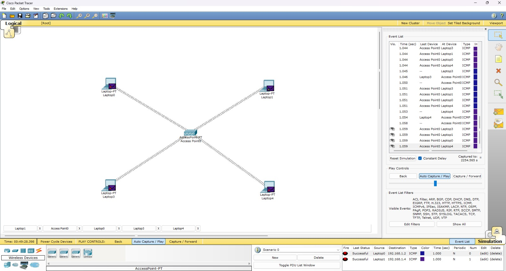

# Design and Simulation of Basic Network Topologies using Cisco Packet Tracer

## 1. Introduction
This project focuses on understanding basic computer networking concepts by designing and simulating different network topologies using Cisco Packet Tracer. The goal is to observe how devices communicate, how data flows in a network, and how different networking devices behave.

---

## 2. Objectives
- To design basic wired and wireless network topologies  
- To understand the working of hub, switch, and access point  
- To configure IP addresses manually  
- To test communication using ICMP (ping)  
- To analyze packet flow using simulation mode  

---

## 3. Tools and Technologies
- Cisco Packet Tracer  
- Devices used:
  - PC  
  - Laptop  
  - Hub  
  - Switch  
  - Access Point  

---

## 4. Project Overview
The project consists of three main network setups:

1. Hub-based wired network  
2. Switch-based wired network  
3. Wireless network using access point  

Each network is tested using ICMP to verify communication between devices.

---

## 5. Implementation Details

### 5.1 Hub-Based Network

#### Steps:
1. Open Cisco Packet Tracer  
2. Add 3 PCs and 1 Hub  
3. Connect all PCs to the hub using copper straight-through cables  
4. Assign IP addresses:
   - PC0: 192.168.1.1  
   - PC1: 192.168.1.2  
   - PC2: 192.168.1.3  
5. Switch to Simulation Mode  
6. Send ICMP packet using Add Simple PDU  

#### Observation:
The hub broadcasts data to all connected devices, making communication inefficient.

#### Image:

---

### 5.2 Switch-Based Network

#### Steps:
1. Add multiple laptops and one switch  
2. Connect each laptop to the switch using straight-through cables  
3. Assign IP addresses in the same network range  
4. Test communication using ping  

#### Observation:
The switch sends data only to the intended device, improving efficiency.

#### Image:

---

### 5.3 Wireless Network using Access Point

#### Steps:
1. Add laptops and one access point  
2. Connect laptops wirelessly using SSID  
3. Assign IP addresses  
4. Test communication using ping  

#### Observation:
Devices communicate wirelessly without physical cables.

#### Image:

---

## 6. Simulation and Testing

Steps followed:
1. Switch to Simulation Mode  
2. Use Add Simple PDU tool  
3. Select source and destination devices  
4. Observe packet flow and protocol behavior  

Results:
- Successful ICMP communication  
- ARP resolution observed  
- Proper packet delivery between devices  

---

## 7. Key Learnings
- Difference between hub and switch  
- Basics of IP addressing  
- Working of ICMP protocol  
- Wired vs wireless communication  
- Packet flow visualization  

---

## 8. Limitations
- No router used  
- No internet connectivity  
- No security configuration  
- Manual IP assignment only  

---

## 9. Future Scope
- Implement router for multiple networks  
- Configure DHCP server  
- Apply VLAN segmentation  
- Add network security features  

---

## 10. Conclusion
This project helped in understanding fundamental networking concepts through practical implementation. It provided hands-on experience in building and testing network topologies using simulation tools.

---

## 11. How to Add Images

### Method 1: Local Images
1. Create a folder named `images` in your project directory  
2. Save screenshots inside the folder  
3. Use the following syntax:

